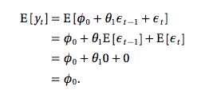

```{r, include=F}
require(timeSeries)
require(tseries)
require(stats)
require(forecast)
library(xts)
library(gdata)
library(plyr)
library(knitr)
library(ggplot2)
library(forecast)


genAR_1 = function(beta0,beta1,n,sigma) {

true_mean= beta0/(1-beta1);
eps=rnorm(n)*sigma;
y=matrix(NA,nrow=n,ncol=1);
y[1]=eps[1];
for (i in 2:n) {	y[i]=beta0+beta1*y[i-1]+eps[i];};

return(y)
}

```

### Problem 1

$$E[AR(1)] = \frac{\beta_0}{1-\beta_1}$$


**a**
i. 
$\mu_1 = 0$

ii. 
$\mu_2 = 0$

iii. 
$\mu_3 = 0$

iv. 
$\mu_4 = 0$

v. 
$\mu_5 = 10$

**b**
```{r}
ar1 <- genAR_1(0,0,200,1)
ar2 <- genAR_1(0,.9,200,1)
ar3 <- genAR_1(0,.1,200,1)
ar4 <- genAR_1(0,-.5,200,1)
ar5 <- genAR_1(1,.9,200,1)
plot(ar1, type = "l", ylim = c(-20,20), main="Multiple AR(1) Plot")
lines(ar2, col = rainbow(4, alpha = .5)[1])
lines(ar3, col = rainbow(4, alpha  = .5)[2])
lines(ar4, col = rainbow(4, alpha = .5)[3])
lines(ar5, col = rainbow(4, alpha = .5)[4])
```

Yes, the plots look like I would expect, all plots are centered around their respective means and "swing" as a function of their $\beta_1$

**c**

Yes, all of the series appear to be mean reverting, series 1-4 revert to 0, series 5 reverts to 10.

**d**

```{r}
pr <- function(p){
  print(p$pred)
}

p1 <- predict(arima(ar1, order = c(1,0,0)), n.ahead = 1)
p2 <- predict(arima(ar2, order = c(1,0,0)), n.ahead = 1)
p3 <- predict(arima(ar3, order = c(1,0,0)), n.ahead = 1)
p4 <- predict(arima(ar4, order = c(1,0,0)), n.ahead = 1)
p5 <- predict(arima(ar5, order = c(1,0,0)), n.ahead = 1)

mapply(pr, list(p1, p2, p3, p4, p5))
```

**e**

```{r}

oneStep <- function(beta0, beta1, yt){
  beta0 + beta1*yt
}

arimas <- data.frame(beta0 = c(0,0,0,0,1), beta1 = c(0,.9, .1, -.5, .9), yt = c(ar1[200], ar2[200], ar3[200], ar4[200], ar5[200]))

mapply(oneStep, arimas$beta0, arimas$beta1, arimas$yt)
```

**f**

Conditional Variance:

$$Var(Y_t|Y_{t-1}) = Var(\beta_0 + \beta_1 Y_{t-1} + \epsilon_{t})$$
+ Because $Y_{t-1}$ is given all terms excpet for $\epsilon_{t}$ are constants therefore there is the covariance term goes to 0 and we are left with:
$$Var(Y_t|Y_{t-1}) = Var(\beta_0) + Var(\beta_1 Y_{t-1}) + Var(\epsilon_{t})$$
$$Var(Y_t|Y_{t-1}) = Var(\epsilon_{t})$$
$$Var(Y_t|Y_{t-1}) = \sigma^2$$

```{r}
myCI <- function (x){
  list(Upper = x+2, Lower = x-2)
}
myPredicts <- mapply(oneStep, arimas$beta0, arimas$beta1, arimas$yt)
mapply(myCI, myPredicts)
```

**g**
```{r, eval = T}
resAR <- function(ar){
  resid(arima(ar, order = c(1,0,0)))
}
resids <- mapply(resAR, list(ar1, ar2, ar3, ar4, ar5))
acf(resids[2:12,1])
acf(resids[2:12,2])
acf(resids[2:12,3])
acf(resids[2:12,4])
acf(resids[2:12,5])
```


### Problem 2

**a**
```{r}
ma1<-arima.sim(list(ma=c(.8)),n=200) + 1
ma2<-arima.sim(list(ma=c(-.8)),n=200)
```

```{r, eval = F}
# I assume that the first a) and b) on the homework are replicated in later steps, I'll leave the code here incase 
# they aren't
plot(ma1, type = "l", ylim = c(-5,5), main = "Multiples Ma(1) Plot")
lines(ma2, col = "red")
acf(ma1, lag.max=10)
pacf(ma1, lag.max=10)
acf(ma2, lag.max=10)
pacf(ma2, lag.max=10)
```


**a**



Therefore, the unconditional mean for ma1 $= 1$ and the unconditional mean for ma2 $= 0$

**b**

```{r, eval = T}
plot(ma1, type = "l", ylim = c(-5,5))
lines(ma2, col = "red")
```

**c**

Yes, each of the plots look the way that I expect because their means are centered around their expected value and their swing is proportional to their $\theta$ value. 

**d**
```{r}
predict(ma1)$mean[1]
predict(ma2)$mean[1]
```

**e**
```{r}
maOneStep <- function(mean, theta, prev){
  mean + theta*prev
}

maOneStep(1, .8, ma1[200])
maOneStep(0, -.8, ma2[200])
```

**f**
```{r}
maCI <- function(mean, theta, prev, p){
  cur <- maOneStep(mean, theta, prev)
  upper<-p$upper[1,2]
  lower<-p$lower[1,2]
  return(data.frame(forecast = cur, upr = upper, lwr = lower))
}

maCI(1, .8, ma1[200], predict(ma1))
maCI(0, -.8, ma2[200], predict(ma2))
```

**g**
```{r, eval = T}
acf(ma1, lag.max=12)
pacf(ma1, lag.max=12)
acf(ma2, lag.max=12)
pacf(ma2, lag.max=12)
```

### Problem 3
```{r}
hpc <- read.xls("hpchicago.xls", skip = 1)
hpc <- subset(hpc, select = c(YEAR, CHXR, ret_raw, CHXR.SA, ret_sa))
hpc <- hpc[complete.cases(hpc),]
hpcXts <- xts(subset(hpc, select = c(ret_sa)), order.by = as.Date(as.yearmon(hpc$YEAR)))
plot(as.xts(hpcXts), main = "Multiple MA(1) Plots")
```

**a**
```{r}
ar1 <- arima(hpc$ret_sa, order = c(1,0,0))
summary(ar1)
```

**b**
```{r}
ar4 <- arima(hpc$ret_sa, order = c(4,0,0))
```

```{r, eval = F}
# Used for testing but not printed here because their are so many plots on this assignment
acf(hpc$ret_sa)
pacf(hpc$ret_sa)
```

```{r, eval = T}
e4 <- resid(ar4)
acf(e4)
pacf(e4)
```

```{r, eval = T}
e1 <- resid(ar1)
acf(e1)
pacf(e1)
```

For this problem, I looked at the acf and pacf plots and compared the auto-correlation and partial auto-correlation of the residulas. Because we do not know any good test statistics for time series, I tried to visualally minimize the correlations in the residuals and ar4 was clearly the best.


**c**

```{r}
1 - var(resid(ar4)) / var(fitted(ar4) +resid(ar4)) * ((length(fitted(ar4)) - 1) /  (length(fitted(ar4)) - 4 - 1))
1 - var(resid(ar1)) / var(fitted(ar1) + resid(ar1)) * ((length(fitted(ar4)) - 1) /  (length(fitted(ar4)) - 1 - 1))
```

The AR(4) model out performs the AR(1) as measured by $R^2$

**d**

```{r}
par4 <- predict(ar4)
par1 <- predict(ar1)
par4$pred
par1$pred
```

### Problem 4

```{r}
ff <- read.xls("FedFunds.xls")
ff <- rename(x = ff, c("DATE......"="date", "X.FFO"="ffo"))
```


**a**

```{r}
ffXts = xts(x=ff$ffo, order.by=as.Date(ff$date, "%Y-%m-%d"))
plot(as.xts(ffXts))
cat("Sample Mean: ", mean(ff$ffo), "Standard Error: ", sd(ff$ffo)/sqrt(length(ff$ffo)))
```

**b**

```{r,}
cat("Sample Variance: ", var(ff$ffo))
```

**c**

```{r}
acf(ff$ffo)
pacf(ff$ffo)

ar1 <- arima(ff$ffo, order = c(4,0,0))
arMa1 <- arima(ff$ffo, order = c(2,0,0))
```


```{r, eval = T}
summary(ar1)
summary(arMa1)
```


**d**

```{r, eval = T}
acfPacfResid <- function (model){
  acf(resid(model))
  pacf(resid(model))
}
mapply(acfPacfResid, list(ar1,arMa1))
```


**e**
```{r, eval = T}
xtsMe <- function(me){
  myXts = xts(x=(ff$ffo - me$residuals), order.by=as.Date(ff$date, "%Y-%m-%d"))
  plot(as.xts(myXts))
}
mapply(xtsMe, list(ar1, arMa1))
```


## Problem 5

**a**

```{r}

ff$ar4Pred <- fitted(ar1)
ff$arMaPred <- fitted(arMa1)

payoffSitu1 <- ff$ffo[-1] - ff$Future[-1] 
payoffSitu2 <- ff$Future[-1] - ff$ffo[-1]

myDiffSitu1 <- as.numeric(ff$ar4Pred[-1] - ff$Future[-1] > 0)
myDiffSitu2 <- as.numeric(ff$ar4Pred[-1] - ff$Future[-1] <= 0)

myDiffSitu12 <- as.numeric(ff$arMaPred[-1] - ff$Future[-1] > 0)
myDiffSitu22 <- as.numeric(ff$arMaPred[-1] - ff$Future[-1] <= 0)

payoffStrat1 <- c(NA, myDiffSitu1 * payoffSitu1 + myDiffSitu2 * payoffSitu2)
payoffStrat2 <- c(NA, myDiffSitu12 * payoffSitu1 + myDiffSitu22 * payoffSitu2)

ff <- cbind(ff, payoffStrat1, payoffStrat2)

plot(ff$payoffStrat1[-1], type = "l")
lines(ff$payoffStrat2[-1], col = "red")
```


**b**
```{r}
kable(head(ff))
cat("Mean ar4: ", mean(ff$payoffStrat1[-1]), "Sd ar4: ", sd(ff$payoffStrat1[-1]))
cat("Mean arMa: ", mean(ff$payoffStrat2[-1]), "Sd arMa: ", sd(ff$payoffStrat2[-1]))

```

**c**

```{r}
cat("Test Stat ar4: ",mean(ff$payoffStrat1[-1])/(sd(ff$payoffStrat1[-1])/sqrt(length(ff$payoffStrat1[-1]))))
cat("Test Stat arMa: ", mean(ff$payoffStrat2[-1])/(sd(ff$payoffStrat2[-1])/sqrt(length(ff$payoffStrat2[-1]))))
```

For both of these strategies, I reject the null hypothesis that their returns could be random. (Yay, profit!)

**d**

```{r}
d <- ff$payoffStrat1[-1] - ff$payoffStrat2[-1]

mean(d)/(sd(d)/sqrt(length(d)))
```

I fail to reject the null that the average returns for the two models are the null.


### Problem 6

**a**
```{r}
returns <- read.csv("table.csv")
returns$DateTime <- as.Date(returns$Date, "%Y-%m-%d")
returns <- returns[order(returns$DateTime, decreasing=F),]

returns <- returns[complete.cases(returns),]

returns$continuous <- log(returns$Close) - log(returns$Open[1])

plot(returns$continuous, type = "l")

```

**b**
```{r}
model <- arima(returns$continuous, order = c(1,0,0))
acf(resid(model)[2:20])
pacf(resid(model)[2:20])
```

Based on this AR model, after controlling for the t-1 change, almost all of the subestquent residuals are uncorrellated. Therefore, the AR(1) fit works well.

**c**
```{r}
model <- arima(returns$continuous, order = c(0,0,1))
acf(resid(model)[2:20])
pacf(resid(model)[2:20])
```

Based on the acf of this model, we see that our errors may be highly correlated if we use and MA(1) model and therefore, we should reconsider.