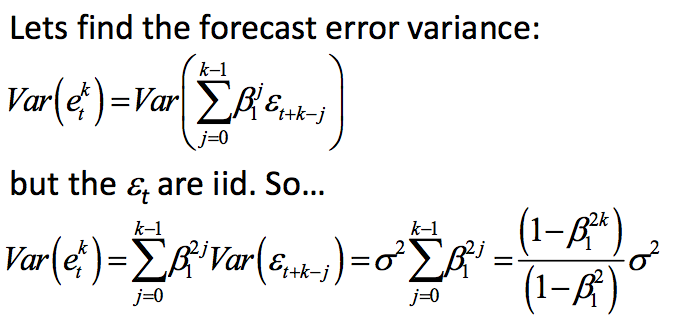

```{r, include=F}
require(timeSeries)
require(tseries)
require(stats)
require(forecast)
library(xts)
library(gdata)
library(plyr)
library(knitr)
library(ggplot2)
library(forecast)
require(plotrix)
```


**Reading**
```{r}
gdp <- read.xls("gdp.xls", skip = 17)
tb <- read.csv("tbill.csv")

sp500 <- read.csv("table.csv")
sp500$DateTime <- as.Date(sp500$Date, "%Y-%m-%d")
sp500 <- sp500[order(sp500$DateTime, decreasing=F),]
sp500 <- sp500[complete.cases(sp500),]
```


### Problem 1

***Set up***
```{r}
year<-tb$Year
tbill<-tb$tbill
plot(tbill[1:80], tbill[2:81])
plot(year,tbill, type="l")
acf(tbill,lag.max=20)
pacf(tbill,lag.max=20)
ar<-arima(tbill,order=c(1,0,0))
summary(ar)
```

**a**
```{r}
p<-predict(ar,n.ahead=15)
kable(p)
```


**b**
As we predict further out, our prediction for our errors changes over time:



```{r}
seMe <- var(ar$residuals) / length(ar$residuals)
beta1 <- as.numeric(ar$coef[1])

errVarMe <- function(k){
  (1 - beta1^(2*k)) / (1- beta1^2) * seMe
}

mapply(errVarMe, c(1:15))
```


**c**

```{r}
arMu <- as.numeric(ar$coef[2]) / (1-as.numeric(ar$coef[1]))

ciMe <- function(sig){
  data.frame(Upper = 2*abs(sig), Lower = 2*abs(sig))
}


intervals <- data.frame(t(mapply(ciMe, p$se)))
intervals <- cbind(intervals, data.frame(Point = p$pred))
intervals$Upper <- as.numeric(as.numeric(intervals$Upper) + intervals$Point)
intervals$Lower <- as.numeric(as.numeric(intervals$Lower) + intervals$Point)
plot(x = index(intervals$Point), y = intervals$Point, ylim = c(-1,1))
lines(x = index(intervals$Point), y = intervals$Lower, col = "green")
lines(x = index(intervals$Point), y = intervals$Upper, col = "green")
```


### Problem 2

```{r}
plot.ts(gdp$VALUE)
plot.ts(log(gdp$VALUE))
```

**a**
```{r}
grwRate <- diff(log(gdp$VALUE)) 
mean(grwRate)
```

```{r}
rwfPred <- rwf(grwRate, h=4, drift=T, level=c(80,95), fan=FALSE, lambda=NULL)
```

```{r}
as.numeric(rwfPred$upper[,2])
as.numeric(rwfPred$lower[,2])
```


### Problem 3

```{r}

```

**a**
```{r}
dailyReturns <- abs(sp500$Open - sp500$Close)
plot.ts(dailyReturns)
```


**b**
```{r}
acf(dailyReturns)
```

Because the auto-correlations are consistently higher than the critical value, we reject the null hypothesis that the difference in absolute daily returns is not auto-correlated. Namely, we concluded that there is a relationship between the absolute value of yesterday's returns and today's returns.

**c**
```{r}
kurtosis(sp500$Open - sp500$Close)[1]
```

R returns the excess Kurtosis over and above a normal distrobution. Therefore, we can see that the returns have MUCH fatter tails than a normal distrobution would suggest.


### Problem 4

**a**
```{r}
r2=252*dailyReturns*dailyReturns
ar=sqrt(252)*r2
ma <- sqrt(filter(r2,rep(1/100,100), sides=1))
plot(sp500$DateTime,ma,type="l",col="red")
```

**b**
```{r}
ma <- sqrt(filter(r2,rep(1/252,252), sides=1))
plot(sp500$DateTime,ma,type="l",col="red")
```


