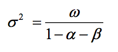

```{r, include=F}
require(timeSeries)
require(tseries)
require(stats)
require(forecast)
library(xts)
library(gdata)
library(plyr)
library(knitr)
library(ggplot2)
library(forecast)
require(plotrix)
require(fGarch)
```


**Reading**
```{r}
gdp <- read.xls("gdp.xls", skip = 17)

gdpGrowth <- 

tb <- read.csv("tbill.csv")

sp500 <- read.csv("table.csv")
sp500$DateTime <- as.Date(sp500$Date, "%Y-%m-%d")
sp500 <- sp500[order(sp500$DateTime, decreasing=F),]
sp500 <- sp500[complete.cases(sp500),]

hp <- read.csv("table (1).csv")
hp$DateTime <- as.Date(hp$Date, "%Y-%m-%d")
hp <- hp[order(hp$DateTime, decreasing=F),]
hp <- hp[complete.cases(hp),]

spRet <- diff(log(sp500$Adj.Close))
hpRet <- diff(log(hp$Adj.Close))
```


### Problem 1

***Set up***
```{r}
year<-tb$Year
tbill<-tb$tbill
plot(tbill[1:80], tbill[2:81])
plot(year,tbill, type="l")
acf(tbill,lag.max=20)
pacf(tbill,lag.max=20)
ar<-arima(tbill,order=c(1,0,0))
summary(ar)
```

**a**
```{r}
p<-predict(ar,n.ahead=15)
kable(head(data.frame(Predictions = c(p$pred))))
```


**b**
As we predict further out, our prediction for our errors changes over time:

```{r fig.width=5, fig.height=3,echo=FALSE}
library(png)
library(grid)
img <- readPNG("./varSlide.png")
 grid.raster(img)
```

```{r}
p<-predict(ar,n.ahead=15)
kable(head(data.frame(Variance = c(p$se^2))))
```


**c**

```{r, fig.height=6}
plot(p$pred, ylim = c(-.02,.12))
lines(p$pred + 2 * p$se, col = "green")
lines(p$pred - 2 * p$se, col = "green")
```


### Problem 2

```{r, fig.height = 6}
plot.ts(log(gdp$VALUE))
```

**a**
```{r}
grwRate <- diff(log(gdp$VALUE)) 
mean(grwRate)
```

```{r}
rwfPred <- rwf(log(gdp$VALUE), h=4, drift=T, level=c(80,95), fan=FALSE, lambda=NULL)
rwfPred$model$drift
```

```{r}
kable(head(data.frame(Upper = c(as.numeric(exp(rwfPred$upper[,2]))))))
kable(head(data.frame(Upper = c(as.numeric(exp(rwfPred$lower[,2]))))))
```


### Problem 3

**a**
```{r}
spRet <- diff(log(sp500$Adj.Close))  # This should have already been defined but R doesn't think so
dailyReturns <- spRet
plot.ts(dailyReturns)
```


**b**
```{r}
acf(dailyReturns)
```

Because the auto-correlations are consistently higher than the critical value, we reject the null hypothesis that the difference in absolute daily returns is not auto-correlated. Namely, we concluded that there is a relationship between the absolute value of yesterday's returns and today's returns.

**c**
```{r}
kurtosis(dailyReturns)[1]
```

R returns the excess Kurtosis over and above a normal distrobution. Therefore, we can see that the returns have MUCH fatter tails than a normal distrobution would suggest.


### Problem 4

**a**
```{r}
r2=252*dailyReturns*dailyReturns
ar=sqrt(252)*r2
ma <- sqrt(filter(r2,rep(1/100,100), sides=1))
plot(ma,type="l",col="red")
```

**b**
```{r}
ma <- sqrt(filter(r2,rep(1/252,252), sides=1))
plot(ma,type="l",col="red")
```


### Problem 5

**a, b, c**

```{r, fig.height=7}
smoother <- function(lambda){
  rmvar <- matrix(0,nrow=length(ar),ncol=1)
  rmvar[1,1] <- var(ar)
  for (i in 2:length(rmvar)){
    rmvar[i,1] <- (lambda*rmvar[i-1,1])+((01-lambda)*ar[i-1]^2)
  }
  sqrt(rmvar)
}

plot.ts(data.frame(".95" = c(smoother(.95)), ".80" = c(smoother(.8)), ".1" = c(smoother(.1))), main = "Smoother Comparison")
```

### Problem 6

**a**

```{r}
myGarch <- function(r, h){
  .00045 + .04^2*r^2 + .94*h
}
myGarch(.04, .03)
```

**b**

```{r}
myGarch(.01, .03)
```

**c**



```{r}
.00045/(1-.04-.94)
```


### Problem 7

**a**

```{r}
a1 <- garchFit(~garch(1,0),data=dailyReturns, trace = F)
-1*a1@fit$llh
```

**b**

```{r}
a9 <- garchFit(~garch(9,0),data=dailyReturns, trace = F)
-1*a9@fit$llh
```


**c**

```{r}
g11 <- garchFit(~garch(1,1),data=dailyReturns, trace = F)
-1*g11@fit$llh
```

**d**
```{r}
g22 <- garchFit(~garch(2,2),data=dailyReturns, trace = F)
-1*g22@fit$llh
```

**e**
Based on the log likelihood values, my garch22 is performing the best.

### Problem 8


**a**
```{r}
dailyVar <- volatility(g22)^2
```

**b**
```{r}
interval <- data.frame(Upper <- c(sqrt(g22@h.t)*2), Lower <- c(-sqrt(g22@h.t)*2))

100 * (sum(as.numeric(sp500$Adj.Close[-1] < interval$Upper & sp500$Adj.Close[-1]) > interval$Lower)/length(sp500$Adj.Close))
```

**c**
```{r}
plot.ts(spRet)
lines(interval$Upper, col = "red")
lines(interval$Lower, col = "red")
```

### Problem 9

**a**
```{r}
diffHp<- hpRet
diffSp <- spRet
skewness(diffHp)
kurtosis(diffHp)
skewness(diffSp)
kurtosis(diffSp)
acf(diffHp^2)
acf(diffSp^2)
```

**b**
```{r}
hpGarch <- garchFit(~garch(1,1),data=diffHp, trace = F)
summary(hpGarch)
volHp <- sqrt(252)*volatility(hpGarch)
```

```{r, fig.height=6}
spGarch <- garchFit(~garch(1,1),data=diffSp, trace = F)
summary(spGarch)
volSp <- sqrt(252)*volatility(spGarch)
plot(volSp, type = "l")
lines(volHp, col = "red")
legend("topleft", c("SP500","HP"), pch=1, col=c('black', 'red'), lty=1, cex=.75)
```

The annualized volatility of the S&P500 appears to have less volatility over all but there is one voltile day that exceeds all of the volatility of HP.

**c**

```{r}
as.numeric(spGarch@fit$coef[2])/(1-as.numeric(spGarch@fit$coef[3])-as.numeric(spGarch@fit$coef[4]))
var(diffSp)

as.numeric(hpGarch@fit$coef[2])/(1-as.numeric(hpGarch@fit$coef[3])-as.numeric(hpGarch@fit$coef[4]))
var(diffHp)
```

The values are extremely close!

**d**

```{r, fig.height=6}
standardHP <- residuals(hpGarch, standardize = T)
standardSP <- residuals(spGarch, standardize = T)

hist(standardHP, breaks = 30)
skewness(standardHP)
kurtosis(standardHP)
```

```{r, fig.height=6}
hist(standardSP, breaks = 30)
skewness(standardSP)
kurtosis(standardSP)
```

My histogram looks normal but the kortousis is far in excess of normal. 

**e**

Based on the statistics, the the tails are much fatter than a normal distrobution so you would fail to predict outliers.

**f**
```{r}
hpForecast<-predict(hpGarch,n.ahead=250)
ts.plot(hpForecast$meanError,type="l")

spForecast<-predict(spGarch,n.ahead=250)
ts.plot(spForecast$meanError,type="l")
```


**g**
```{r}
mean(hpForecast$standardDeviation^2)
mean(spForecast$standardDeviation^2)
```

**h**
```{r}
acf((standardSP)^2)
acf((standardHP)^2)
```


### Problem 10

**a**

The mean of the profile should be the expectation of the linear combination of the weighted portfolio:
$$\mu_w = w * \mu_{sp} + (1 - w)*r_f$$

The variance of the profile should be the variance of the linear combination of the weighted portfolio:
$$\sigma^2 = w^2 * \sigma_{sp}^2 + (1 - w)^2*\sigma^2_{r_f}$$

By definition, the variance of the risk free rate is 0:

$$\sigma^2 = w^2 * \sigma_{sp}^2$$

**b**

$$U(w) = (w * \mu_{sp} + (1 - w)*r_f) - \frac{\lambda}{2}(w^2 * \sigma_{sp}^2)$$


Maximize by setting the derivative to 0:
$$\frac{dU}{dw} = \mu_{sp} - r_f - \lambda w \sigma_{sp}^2 = 0$$
$$\lambda = \frac{\mu_{sp} - r_f}{w \sigma_{sp}^2}$$

Therefore, if $\lambda = 5$:

$$5 = \frac{\mu_{sp} - r_f}{w \sigma_{sp}^2}$$
$$w = \frac{\mu_{sp} - r_f}{5 \sigma_{sp}^2}$$


**c**
```{r, eval = F}
mean(diffSp)
var(diffSp)

w <- (mean(diffSp) - (.02/252) )/ (5 * var(diffSp))
print(w)
```


$\mu_{sp} =  `r mean(diffSp)`$

$\sigma_{sp}^2 = `r var(diffSp)`$

$r_f =  `r .02/252`$


**d**

```{r}
w <- (mean(diffSp) - (.02/252) )/ (5 * var(diffSp))
U <- (w * mean(diffSp) - (1-w)*.02/252) - 5/2*(w)
U
```


### Problem 11

**a**
```{r}
w <- (mean(diffSp) - (.02/252) )/ (5 * var(diffSp))

utility <- function(h){
  w*mean(diffSp) + (1-w)*.02/252 - 5/2 * (w^2*h)
}

weight <- function(h){
  (mean(diffSp) - .02/252) / (5 * h)
}

garch.model <- garchFit(~garch(2,2),data=diffSp,trace = F)
weights <-mapply(weight, as.numeric(garch.model@h.t))

plot(garch.model@h.t, weights)
```


Yes, this makes sense because volatility is associated with negative periods of return in the market.


**b**
```{r}
realized <- function(weight){
  weight * mean(diffSp) - (1 - weight)*(.02/252)
}
returns <- mapply(realized, weights)

plot(returns, type = "l")
```

**c**
```{r}
meanRet <- mean(returns)
weightedVar <- 5/2 * sum(returns)

meanRet - weightedVar
```

**d**
```{r}
us <- returns - 5/2*(returns - meanRet) 
sd(us)/sqrt(length(us))
```

**e**
```{r}
uBar <- mean(returns) - 5/2*sum((returns - meanRet)^2) 
print((uBar - U) / (sd(us)/sqrt(length(us))))
```

I am clearly rejecting the null, at the moment, (however, due to the lateness) I am going to claim this is a implementation error and with more sleep, I would have written better R.
